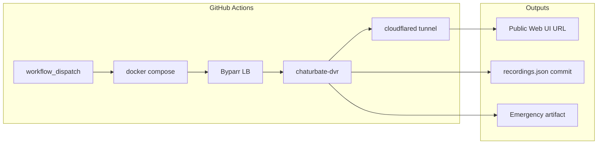

<div align="center">

# Chaturbate DVR

### Record multiple live streams automatically — locally, in Docker, or on GitHub Actions.

[](https://github.com/vasud3v/chaturbate-recorder/actions/workflows/recorder.yml)
[](https://github.com/vasud3v/chaturbate-recorder/blob/main/docker-compose.yml)
[](https://github.com/vasud3v/chaturbate-recorder/blob/main/go.mod)
[](https://github.com/vasud3v/chaturbate-recorder/blob/main/LICENSE)

**Actively maintained fork** of [teacat/chaturbate-dvr](https://github.com/teacat/chaturbate-dvr) with Cloudflare bypass, multi-host uploads, and cloud recording.

[Features](#features) · [Quick start](#quick-start) · [GitHub Actions](#github-actions-247-recorder) · [Docker](#docker-full-stack) · [CLI](#command-line-options) · [FAQ](#faq)

If this project saves you time, consider giving it a **star** — it helps others find it.

</div>

---

> **Note:** The original [teacat/chaturbate-dvr](https://github.com/teacat/chaturbate-dvr) project is no longer maintained. This repository continues development with Docker, Byparr, uploads, and **GitHub Actions** support.

<p align="center">
  
  
</p>

---

## Features

| | |
|---|---|
| **Multi-channel DVR** | Monitor many models from one dashboard |
| **Web UI + CLI** | Browser control or headless single-channel mode |
| **HLS capture** | Classic `.ts` and LL-HLS `.m4s` (split audio/video) |
| **Cloudflare bypass** | [Byparr](https://github.com/ThePhaseless/Byparr) + auto cookie refresh |
| **GitHub Actions** | Run the full stack on `ubuntu-latest` for hours, no home server |
| **Auto uploads** | GoFile, Streamtape, Voe.sx, SendCM, Byse, TurboViPlay |
| **Thumbnails** | Pixhost → Catbox → Freeimage fallback for previews & sprites |
| **ffmpeg** | Mux, compress `.mkv`, segment by duration or size |
| **Live updates** | Server-Sent Events in the dashboard |

---

## Quick start

### Option A — Docker (recommended)

```bash
git clone https://github.com/vasud3v/chaturbate-recorder.git
cd chaturbate-recorder
cp .env.example .env   # add upload API keys (optional)
docker compose up -d --build
```

Open **[http://localhost:8080](http://localhost:8080)** and add channels. Configuration is saved to `conf/channels.json`.

### Option B — Pre-built binary (upstream style)

Download a release from [this repo’s Releases](https://github.com/vasud3v/chaturbate-recorder/releases) or [teacat/chaturbate-dvr Releases](https://github.com/teacat/chaturbate-dvr/releases), or build from source:

```bash
go build -o chaturbate-dvr .
./chaturbate-dvr
```

### Option C — GitHub Actions (cloud recorder)

No VPS required. See **[GitHub Actions 24/7 Recorder](#github-actions-247-recorder)** below.

---

## GitHub Actions 24/7 Recorder

Run the entire recorder stack on GitHub-hosted runners — Docker, Byparr, uploads, and a public web UI via Cloudflare tunnel.



### What the workflow does

1. Starts **Byparr** (Cloudflare bypass) behind an nginx load balancer  
2. Builds and runs **chaturbate-dvr**, **cookie-refresher**, and **uploader**  
3. Exposes the dashboard on a **trycloudflare.com** URL (saved to Supabase)  
4. Records for **1–5 hours** (configurable), with health checks and auto-restart  
5. Stores upload metadata in Supabase instead of committing `database/recordings.json`  
6. Uploads an **emergency backup** artifact of any captured videos
7. Can **queue the next run** for continuous operation  

Workflow file: [`.github/workflows/recorder.yml`](https://github.com/vasud3v/chaturbate-recorder/blob/main/.github/workflows/recorder.yml)

### Setup (one time)

1. **Fork** this repository (or use your own copy).

2. Add **repository secrets** (`Settings` → `Secrets and variables` → `Actions`):

   | Secret | Required | Purpose |
   |--------|----------|---------|
   | `SUPABASE_URL` | Yes | Tunnel URL & heartbeat storage |
   | `SUPABASE_API_KEY` | Yes | Supabase REST API key |
   | `STREAMTAPE_LOGIN` | For uploads | Streamtape account |
   | `STREAMTAPE_API_KEY` | For uploads | Streamtape API key |
   | `VOESX_API_KEY` | For uploads | Voe.sx |
   | `SENDCM_API_KEY` | For uploads | SendCM |
   | `GOFILE_API_KEY` | Optional | GoFile (guest OK without) |
   | `BYSE_API_KEY` | Optional | Byse.sx |
   | `PROXY_SERVER` | Optional | Proxy for Byparr |
   | `PROXY_USERNAME` | Optional | Proxy auth |
   | `PROXY_PASSWORD` | Optional | Proxy auth |

3. Configure channels in **[`conf/channels.json`](https://github.com/vasud3v/chaturbate-recorder/blob/main/conf/channels.json)** (commit to the repo):

   ```json
   [
     {
       "is_paused": false,
       "username": "channel_name",
       "framerate": 30,
       "resolution": 1080,
       "pattern": "videos/{{.Username}}_{{.Year}}-{{.Month}}-{{.Day}}_{{.Hour}}-{{.Minute}}-{{.Second}}{{if .Sequence}}_{{.Sequence}}{{end}}",
       "max_duration": 0,
       "max_filesize": 0,
       "compress": true,
       "created_at": 0
     }
   ]
   ```

4. Run the workflow: **Actions** → **24/7 Recorder** → **Run workflow** → choose duration (1–5 hours).

5. Open the **run summary** for the public Web UI link, or query Supabase `tunnel_sessions` / `heartbeats`.

> **Limits:** GitHub-hosted runners have disk and time caps (~5 h max per run in this workflow). Videos are not persisted on GitHub long-term — use upload hosts and Supabase for links and metadata.

---

## Docker full stack

| Service | Port | Description |
|---------|------|-------------|
| `chaturbate-dvr` | `8080` | Recorder + web UI |
| `byparr-lb` | `8191` | Load-balanced Cloudflare bypass |
| `byparr` | (internal) | Byparr workers (×2) |
| `cookie-refresher` | — | Keeps `cf_clearance` fresh |
| `uploader` | — | Python daemon for backlog uploads |

```bash
docker compose up -d --build
docker compose logs -f chaturbate-dvr
```

**Volumes:** `./videos` · `./conf` · `./database`

Environment variables are loaded from `.env` (see [`.env.example`](https://github.com/vasud3v/chaturbate-recorder/blob/main/.env.example)).

---

## Web UI

```bash
# Default: Web UI on port 8080, loads conf/channels.json
./chaturbate-dvr

# Custom port + basic auth
./chaturbate-dvr --port 8123 --admin-username admin --admin-password secret
```

Visit **[http://localhost:8080](http://localhost:8080)**.

<p align="center">
  
</p>

---

## CLI mode

Record a single channel without the dashboard:

```bash
./chaturbate-dvr -u CHANNEL_USERNAME
```

Combine with cookies, quality, and splitting:

```bash
./chaturbate-dvr -u CHANNEL_USERNAME \
  -resolution 1080 -framerate 30 \
  -max-duration 30 \
  -cookies "cf_clearance=YOUR_VALUE; sessionid=YOUR_SESSION" \
  -user-agent "Mozilla/5.0 ..."
```

---

## Command-line options

| Flag | Description | Default |
|------|-------------|---------|
| `--username`, `-u` | Single-channel mode (disables Web UI) | — |
| `--port`, `-p` | Web UI port | `8080` |
| `--framerate` | Target FPS | `30` |
| `--resolution` | Target height (e.g. `1080`) | `1080` |
| `--pattern` | Output filename template | see below |
| `--max-duration` | Split every N minutes (`0` = off) | `0` |
| `--max-filesize` | Split every N MB (`0` = off) | `0` |
| `--interval` | Retry interval when offline (minutes) | `1` |
| `--cookies` | Request cookies (`COOKIES` env) | — |
| `--user-agent` | Custom UA (`USER_AGENT` env) | — |
| `--compress` | ffmpeg → `.mkv` after recording | auto if ffmpeg found |
| `--output-dir` | Move finished files (`OUTPUT_DIR`) | — |
| `--admin-username` / `--admin-password` | HTTP basic auth | — |

Upload keys (also in `.env`): `STREAMTAPE_*`, `VOESX_API_KEY`, `SENDCM_API_KEY`, `GOFILE_API_KEY`, `BYSE_API_KEY`, `TURBOVIPLAY_API_KEY`.

**Filename pattern** uses [Go `text/template`](https://pkg.go.dev/text/template):

`{{.Username}}`, `{{.Year}}`, `{{.Month}}`, `{{.Day}}`, `{{.Hour}}`, `{{.Minute}}`, `{{.Second}}`, `{{.Sequence}}`

Default:

```
videos/{{.Username}}_{{.Year}}-{{.Month}}-{{.Day}}_{{.Hour}}-{{.Minute}}-{{.Second}}{{if .Sequence}}_{{.Sequence}}{{end}}
```

---

## Bypass Cloudflare

### Automatic (Docker / GitHub Actions)

Set `FLARESOLVERR_URL=http://byparr-lb/v1` (included in [`docker-compose.yml`](https://github.com/vasud3v/chaturbate-recorder/blob/main/docker-compose.yml)). The **cookie-refresher** service renews clearance via Byparr.

### Manual (local / CLI)

1. Open [chaturbate.com](https://chaturbate.com) and pass the Cloudflare check.  
2. **F12** → **Application** → **Cookies** → copy `cf_clearance`.  
3. Run with `-cookies` and `-user-agent` (from [whatismybrowser.com](https://www.whatismybrowser.com/detect/what-is-my-user-agent/)).

<p align="center">
  
</p>

### Record private shows

Log in on Chaturbate, copy the `sessionid` cookie, and pass:

```bash
./chaturbate-dvr -u CHANNEL -cookies "sessionid=YOUR_SESSION_ID"
```

---

## Uploads & library

After each recording, the app can upload to multiple hosts in parallel and store links in Supabase as the primary metadata store.

| Host | Env variables |
|------|----------------|
| GoFile | `GOFILE_API_KEY` (optional) |
| Streamtape | `STREAMTAPE_LOGIN`, `STREAMTAPE_API_KEY` |
| Voe.sx | `VOESX_API_KEY` |
| SendCM | `SENDCM_API_KEY` |
| Byse | `BYSE_API_KEY` |
| TurboViPlay | `TURBOVIPLAY_API_KEY` |

**Thumbnails & hover sprites** use a resilient chain: **Pixhost** → **Catbox** → **Freeimage**.

Browse recordings in the Web UI under **Videos**.

---

## Project structure

```
├── main.go                 # CLI entry
├── manager/                # Channels, SSE, conf persistence
├── channel/                # Recording, ffmpeg, uploads
├── chaturbate/             # Stream API & HLS
├── internal/               # HTTP, FlareSolverr, retries
├── router/                 # Gin UI + templates
├── uploader/               # Video & image hosts
├── docker-compose.yml      # Production stack
├── .github/workflows/      # 24/7 Recorder (GitHub Actions)
├── conf/channels.json      # Your channels (committed)
└── database/recordings.json # Legacy local fallback file
```

---

## Development

**Requirements:** Go 1.23+, ffmpeg, Node.js (CSS build)

```bash
npm ci && npm run build:css
go run . --port 8080
```

Useful scripts: `scripts/diagnose-recording.ps1`, `scripts/fix-cloudflare-local.ps1`, `scripts/uploader_daemon.py`.

---

## FAQ

<details>
<summary><b>Port 8080 already in use</b></summary>

Use another port: `./chaturbate-dvr -p 8123` → [http://localhost:8123](http://localhost:8123).

On Windows, if permissions block the port:

```powershell
net stop winnat
net start winnat
```

</details>

<details>
<summary><b>Cloudflare blocked / channel offline</b></summary>

- **Blocked:** Set cookies and User-Agent, or use Docker/Byparr (`FLARESOLVERR_URL`).  
- **Offline / private:** The recorder retries every `--interval` minutes. Private shows need `sessionid` in cookies.

</details>

<details>
<summary><b>GitHub Actions: recording metadata not available</b></summary>

Ensure workflow permissions allow **Read and write** for `GITHUB_TOKEN`. Recording metadata is now stored in Supabase, so `database/recordings.json` is no longer committed by the workflow.

</details>

<details>
<summary><b>Proxy support</b></summary>

```bash
HTTPS_PROXY="socks5://127.0.0.1:9050" ./chaturbate-dvr -u CHANNEL
```

Or set `PROXY_SERVER` / `PROXY_*` for Byparr in `.env`.

</details>

---

## Legal & disclaimer

Use only for content you are **allowed** to record. You are responsible for complying with platform terms and applicable laws. This software is provided **as-is** without warranty.

---

## Credits & license

- Original project: [**teacat/chaturbate-dvr**](https://github.com/teacat/chaturbate-dvr) by TeaCat (MIT)  
- Screenshots in `docs/images/` from the upstream project UI  
- Cloudflare bypass: [**Byparr**](https://github.com/ThePhaseless/Byparr)  
- UI favicon: [Twemoji](https://github.com/twemoji/twemoji) (Twitter’s Twemoji moved to [twemoji/twemoji](https://github.com/twemoji/twemoji))  

Licensed under the [MIT License](https://github.com/vasud3v/chaturbate-recorder/blob/main/LICENSE).

---

<p align="center">
  <sub>Built for reliability in 2026 — Docker, Actions, and uploads out of the box.</sub><br/>
  <sub>⭐ Star this repo if it helped you — thank you!</sub>
</p>
